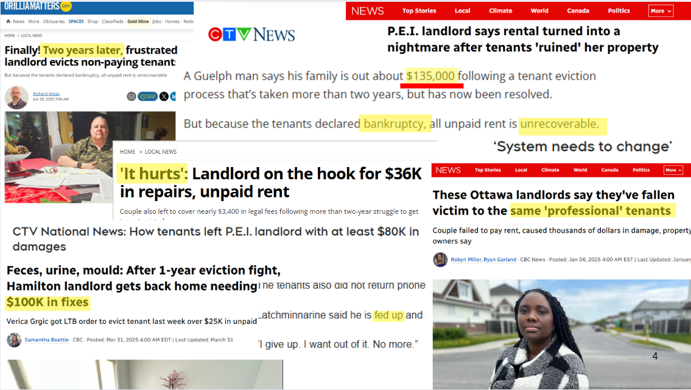
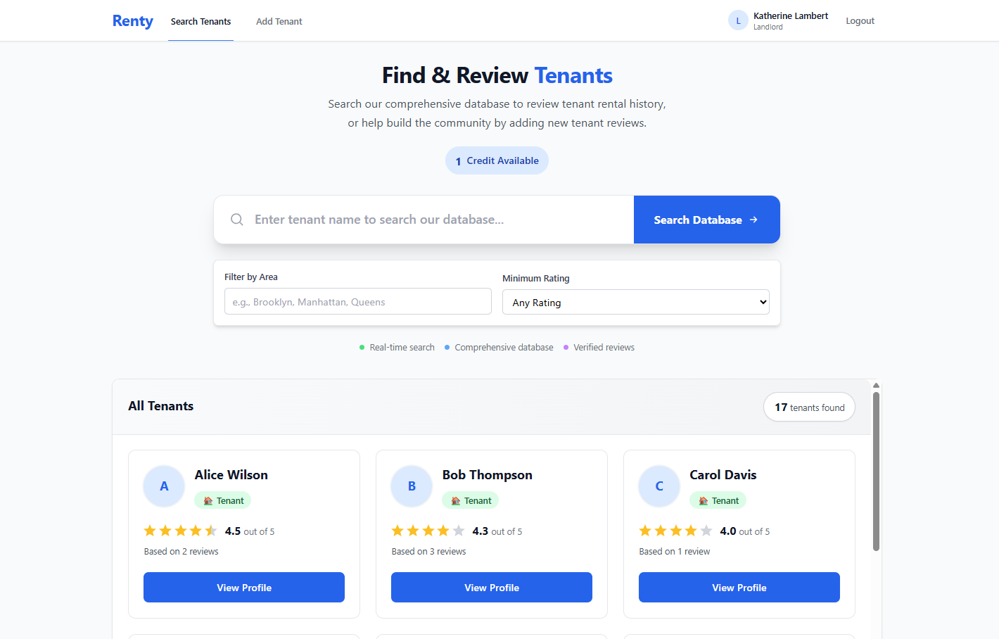
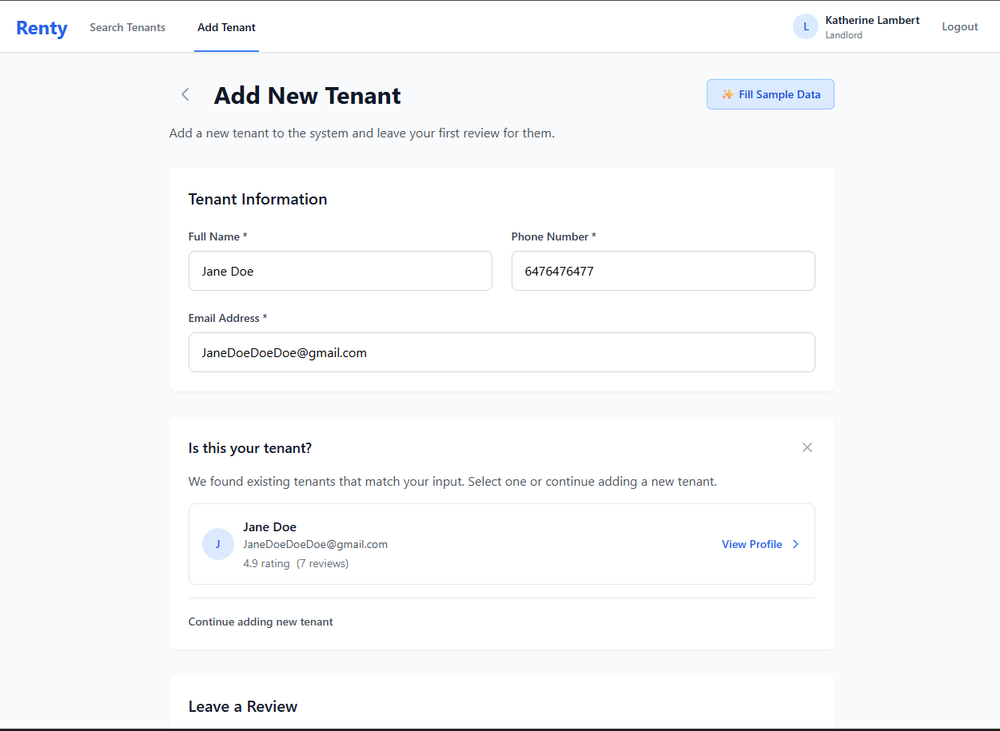
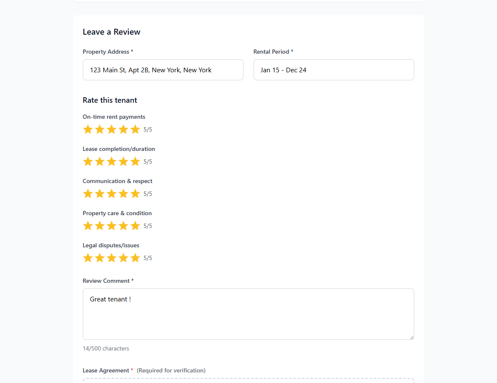
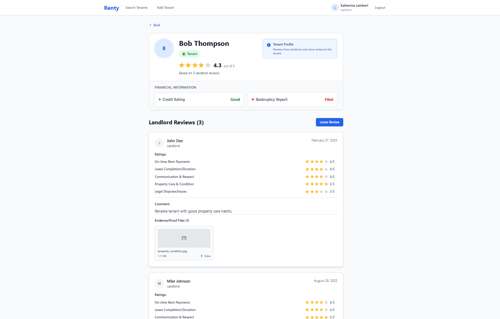
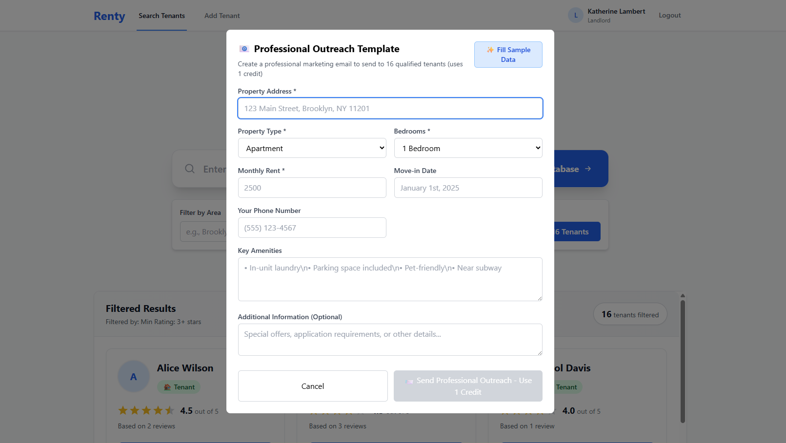

# Renty - Landlord Tenant Review Platform

A full-stack web application that allows landlords to create comprehensive tenant reviews, helps property owners make informed decisions when screening potential tenants, and conduct outreach with rental proposals to tenants in good standing. 

## Inspiration

A bad tenant costs a landlord on average $5,000 in unpaid rent (some lose as much as $135,000!), property damage, legal fees, and lost income. It can take 9 to 12 months to get a court hearing to evict the tenant from the property — all while the landlord is still paying the mortgage, the property taxes, and utilities.


In the U.S. **3.6 million evictions are filed each year**. Multiply that by the average cost of $5,000 — and you’re looking at a 
***$18 billion annual disaster***. 



This is not just a nuisance — it’s a crisis.

... But what if, the landlord could prevent this headache in the first place?

## 🚀 Features

This is what our platform solves. It gives landlords the chance to review poor tenants and add visibility on this platform so that other landlords don't fall victim to the same "professional tenants". The can also leave positive reviews for good ones, helping drive market growth and landlord-tenant satisfaction.

- **Tenant Management**: Add new tenants with contact information
- **Comprehensive Reviews**: Rate tenants on multiple criteria (multi-star rating system of on-time rent payments, lease completion, communication, property care, legal disputes and comments)
- **Backed by real-world data** - Tenant reviews are backed by credit score verification and bankrupcy history for a holistic view of tenant reliability
- **File Uploads**: Upload lease agreements and evidence files (images, videos, PDFs) to back reviews
- **Search & Filter**: Find tenants by name with instant search. Filter by rating and location
- **User Authentication**: Secure JWT-based login system with Auth0 integration
- **Modern UI**: Clean, responsive design with React components
- **Star Ratings**: Visual rating system for easy review display
- **Email Campaigns**: Send email proposals for property leasings to tenants with good scores and reviews through the platform

## Demo

### *Dashboard:*


### *Leave a Review:*



### *View Tenant Profile:*


### *Tenant Outreach Campaign:*


## 🛠️ Tech Stack

**Frontend:**
- React 18 with functional components and hooks
- React Router for navigation
- Axios for API calls
- CSS3 with modern styling
- File upload with drag & drop

**Backend:**
- Node.js with Express.js
- MongoDB with native driver
- JWT authentication with Auth0 integration
- Multer for file uploads
- CORS enabled for cross-origin requests

## 📋 Prerequisites
- Node.js (v14 or higher)
- npm or yarn
- MongoDB (local installation or MongoDB Atlas)

## 🚀 Quick Start

### 1. Clone the Repository
```bash
git clone https://github.com/YourUsername/RentEZ.git
cd RentEZ
```

### 2. Install Dependencies

**Frontend:**
```bash
npm install
```

**Backend:**
```bash
npm install express mongodb jsonwebtoken bcryptjs cors multer dotenv
```

### 3. Environment Setup

Create a `.env` file in the root directory:
```env
MONGODB_URI=mongodb://localhost:27017/rentez
JWT_SECRET=your-super-secret-jwt-key-here
PORT=8000
```

### 4. Start MongoDB

Make sure MongoDB is running on your system:
```bash
# macOS with Homebrew
brew services start mongodb/brew/mongodb-community

# Or if using MongoDB Atlas, use your connection string in MONGODB_URI
```

### 5. Start the Applications

**Terminal 1 - Backend:**
```bash
node backend_server.js
```

**Terminal 2 - Frontend:**
```bash
npm start
```

### 6. Access the Application

- Frontend: http://localhost:3000
- Backend API: http://localhost:8000

## 📚 API Endpoints

### Authentication
- `POST /api/signup` - Register new landlord
- `POST /api/login` - Login landlord

### Tenants
- `GET /api/tenants/search?name=<name>` - Search tenants
- `GET /api/tenants/:id` - Get tenant details
- `POST /api/tenants` - Create new tenant

### Reviews
- `POST /api/reviews` - Submit tenant review

### System
- `GET /api/health` - Health check

## 🎯 Usage

1. **Sign Up**: Create a landlord account
2. **Login**: Access your dashboard
3. **Add Tenant**: Create new tenant profiles with their first review
4. **Leave Reviews**: Add additional reviews for existing tenants
5. **Search**: Find tenants using the search functionality
6. **View Details**: See comprehensive tenant profiles with all reviews

## 📁 Project Structure

```
RentEZ/
├── public/                 # Static assets
├── src/
│   ├── components/         # Reusable React components
│   ├── pages/             # Page components
│   ├── utils/             # Utility functions (API calls)
│   └── App.jsx            # Main app component
├── backend_server.js      # Express server
├── mongodb_schema.js      # Database schema definitions
└── README.md             # This file
```

## 🔧 Development

### Key Components
- `AddTenant.jsx` - Add new tenants with reviews
- `LeaveReview.jsx` - Add reviews for existing tenants
- `Dashboard.jsx` - Main landlord dashboard
- `SearchTenants.jsx` - Tenant search functionality

### Database Schema
- **landlords** - User accounts with authentication
- **tenants** - Tenant profiles and contact information  
- **reviews** - Detailed tenant reviews with ratings

## 🚨 Troubleshooting

**MongoDB Connection Issues:**
- Ensure MongoDB is running
- Check your `MONGODB_URI` in `.env`
- For MongoDB Atlas, whitelist your IP address

**Authentication Errors:**
- Verify `JWT_SECRET` is set in `.env`
- Check token expiration (24h default)

**File Upload Issues:**
- Check file size limits (5MB for images, 50MB total)
- Ensure upload directory permissions

## 📄 License

This project is licensed under the MIT License.

## 🤝 Contributing

1. Fork the project
2. Create a feature branch (`git checkout -b feature/AmazingFeature`)
3. Commit your changes (`git commit -m 'Add some AmazingFeature'`)
4. Push to the branch (`git push origin feature/AmazingFeature`)
5. Open a Pull Request

## 📞 Support

For support, please open an issue on GitHub.
